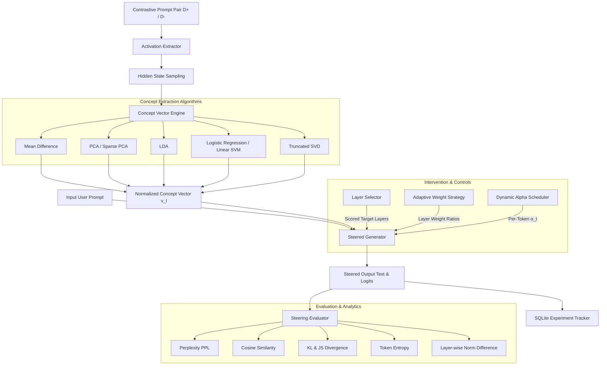
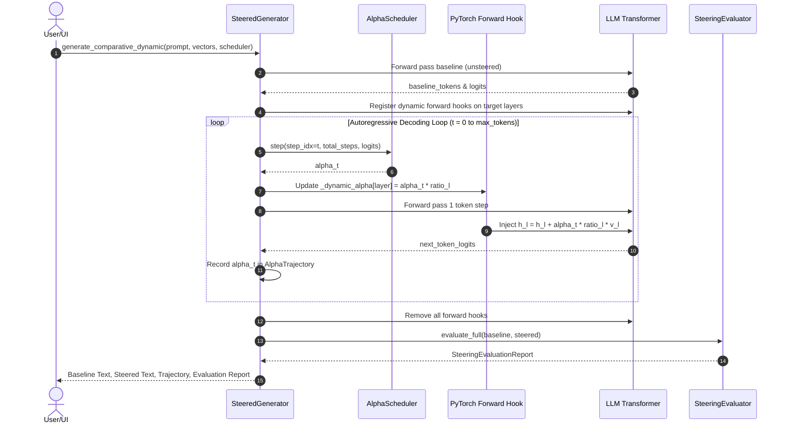
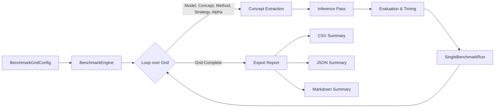

# LatentShift: System Architecture & Sequence Diagrams

This document contains comprehensive architecture, block, and sequence diagrams detailing the internal workflows of LatentShift.

---

## 1. System Architecture Diagram

---

## 2. Dynamic Steering Autoregressive Loop Sequence Diagram

---

## 3. Automated Benchmark Engine Flowchart

